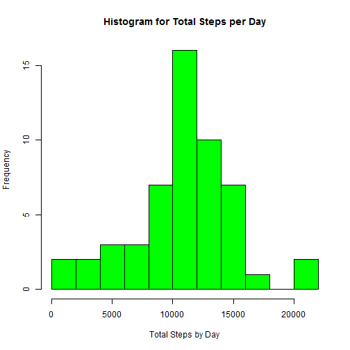
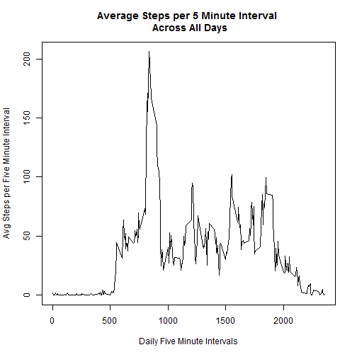
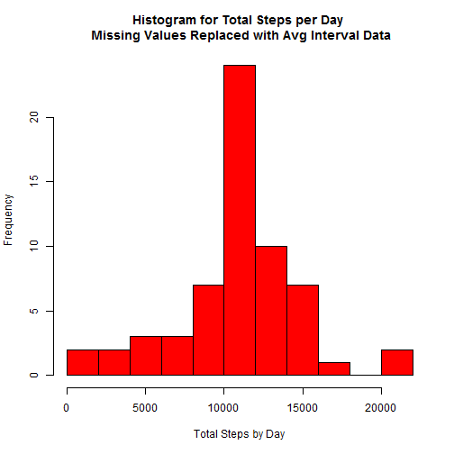
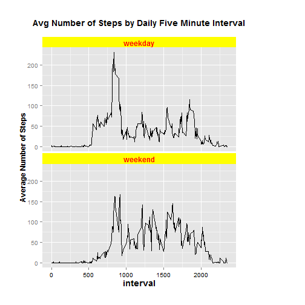

**Requirements**
This analysis requires the use of two packages: dplyr, timeDate, and ggplot2

###Introduction<br/>###
This document analyzes the dataset *Activity monitoring data* and answers the questions as outlined in Peer Assignment 1 in the *Reproducible Research* course. This assignment makes use of data from a personal activity monitoring device. This device collects data at 5 minute intervals throughout the day. The data consists of two months of data from an anonymous individual collected during the months of October and November, 2012 and include the number of steps taken in 5 minute intervals each day.

The variables included in this dataset are:
    
    1. steps: Number of steps taking in a 5-minute interval (missing values are coded as NA)
    2. date: The date on which the measurement was taken in YYYY-MM-DD format
    3. interval: Identifier for the 5-minute interval in which measurement was taken

The data set is a csv file with 17,568 observations.

Preliminaries - loading necessary libraries

```r
library(dplyr)
library(timeDate)
```

###First Steps - Load and Preprocess Data<br/>###

First download the file, unzip, and load into R as activity_data variable.

```r
download.file("https://d396qusza40orc.cloudfront.net/repdata%2Fdata%2Factivity.zip", "repdata%2Fdata%2Factivity.zip")
unzip("repdata%2Fdata%2Factivity.zip")
activity_data <- read.csv("activity.csv")
```

Change the date column to date format.

```r
activity_data$date <- as.Date(activity_data$date, format = "%Y-%m-%d")
```

###Second Step - Calculate the mean total number of steps taken per day<br/>### 

Remove records with NA values from data set

```r
steps_data <- activity_data[complete.cases(activity_data),]
```

Calculate the total number of steps taken each day (NAs have been removed)

```r
total_steps <- steps_data %>% group_by(date) %>% summarise(steps = sum(steps))
```

Plot histogram of total steps per day

```r
hist(total_steps$steps, main = "Histogram for Total Steps per Day", 
     xlab = "Total Steps by Day", breaks = 10, col = "green")
```

 

Calculate and report the mean and median of total steps taken per day

```r
paste("The mean of the total number of steps per day is ", mean(total_steps$steps))
```

```
## [1] "The mean of the total number of steps per day is  10766.1886792453"
```

```r
paste("The median of the total number of steps per day is ", median(total_steps$steps))
```

```
## [1] "The median of the total number of steps per day is  10765"
```

###Third Step - What is the average daily activity pattern?<br/>###
Group by interval variable and make a time series plot of 5 minute interval (x-axis) and the average number of steps take averaged across all days. This also requiers a sort in ascending order for the interval column.

```r
interval_data <- steps_data %>% group_by(interval) %>% summarise(avg_steps = mean(steps))
interval_data <- arrange(interval_data, interval) #sort interval variable in ascending order
plot(interval_data$interval, interval_data$avg_steps, type = "l", xlab = "Daily Five Minute Intervals", ylab = "Avg Steps per Five Minute Interval", main = "Average Steps per 5 Minute Interval \n Across All Days")
```

 

The 5 minute interval that contains the maximum number steps (on average)

```r
x <- which.max(interval_data$avg_steps)
interval_data[x,]
```

```
## Source: local data frame [1 x 2]
## 
##   interval avg_steps
##      (int)     (dbl)
## 1      835  206.1698
```

###Fourth Step - Imputing missing values.<br/>###
Part 1 - calculate the number of missing values

```r
sum(is.na(activity_data$steps))
```

```
## [1] 2304
```

Part 2 & 3 - a strategy for filling in all of the missing values - in this case the mean value for the five minute intervals (across all days) will be used. The values from the interval_data data set
will be used for substitutions into the original data set.

```r
na_data <- filter(activity_data, is.na(steps)) # data frame with NA values
updated_na_data <- merge(na_data, interval_data, by = "interval") # get replacement values for NAs
updated_na_data <- rename(updated_na_data, steps = avg_steps) # rename steps column
updated_na_data <- updated_na_data[c(4,3,1)] # select and reorder columns to match activity_data
# recombine updated_na_data with steps_data (NAs had been removed)
new_activity_data <- rbind(steps_data, updated_na_data)
# reorder date to original order
new_activity_data <- new_activity_data[with(new_activity_data, order(date, interval)), ]
# missing values have now been replaced into original data set.
```

Part 4 - Make a histogram of the total number of steps taken each day. 

```r
total_steps_2 <- new_activity_data %>% group_by(date) %>% summarise(steps = sum(steps))
hist(total_steps_2$steps, main = "Histogram for Total Steps per Day \n Missing Values Replaced with Avg Interval Data", xlab = "Total Steps by Day", breaks = 10, col = "red")
```

 


Calculate and report the mean and median total number of steps taken per day.

```r
paste("The mean of the total number of steps per day is ", mean(total_steps_2$steps))
```

```
## [1] "The mean of the total number of steps per day is  10766.1886792453"
```

```r
paste("The median of the total number of steps per day is ", median(total_steps_2$steps))
```

```
## [1] "The median of the total number of steps per day is  10766.1886792453"
```

Do these values differ from the estimates from the first part of the assignment? What is the impact of imputing missing data on the estimates of the total daily number of steps?

**Answer:**
The shapes of the histograms are similar; however, the values are different. The impact of putting missing data values into the dataset obviously increased the number of steps recorded by day. The mean and median values; however did not change. Replacing the missing values with an average of the intervals did not add any value to the analysis. Other methods of replacing the missing values (e.g., using the average per day, or some random number may provide alternate answers.)


###Fifth Step - Are there differences in activity patterns between weekdays and weekends?<br/>###
Part 1 - Create a new factor variable in the dataset with two levels - "weekday" and "weekend" indicating whether a given date is a weekday or weekend day.

```r
# using the dataset (new_activity_data) where missing values have been replaced (see above).
new_activity_data <- new_activity_data %>% mutate(day = ifelse(isWeekday(date) == TRUE, "weekday", "weekend"))
```

Part 2 - Make a panel plot containing a time series plot (i.e. type = "l") of the 5-minute interval (x-axis) and the average number of steps taken, averaged across all weekday days or weekend days (y-axis). Also, load necessary library (ggplot2) and require grid.


```r
new_interval_data <- new_activity_data %>% group_by(day, interval) %>% summarise(avg_steps = mean(steps)) # group and calculate mean for 5 minute intervals and days
# create plot
library(ggplot2)
require(grid)
```

```
## Loading required package: grid
```

```r
g <- ggplot(new_interval_data, aes(interval, avg_steps))
g <- g + facet_wrap(~ day, ncol = 1) + geom_line()
g <- g + labs(title = "Avg Number of Steps by Daily Five Minute Interval\n")
g <- g + ylab("Average Number of Steps")
g <- g + theme(plot.title = element_text(size = 14, face = "bold"),
               axis.title.x = element_text(size = 14, face = "bold"),
               axis.title.y = element_text(size = 12, face = "bold"),
               axis.text.x = element_text(colour = "black"),
               strip.text = element_text(size = 12, face = "bold", colour = "red"),
               strip.background = element_rect(fill = "yellow"),
               plot.margin = unit(c(1,4,1,1), "cm"))
g
```

 

Conclusion: larger number of steps (on average) for those intervals between 500 & 1000 for the weekday group, plus the number of steps appear to be less for earlier periods of the weekend group.


